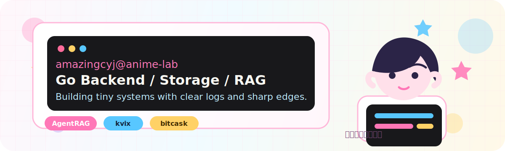

<p align="center">
  
</p>

<h1 align="center">Hi, I'm AmazingCYJ</h1>

<p align="center">
  <a href="https://github.com/AmazingCYJ">
    
  </a>
</p>

<p align="center">
  
  
  
</p>

---

## About Me

```yaml
name: AmazingCYJ
role: Backend Developer
main_stack:
  - Go
  - PostgreSQL
  - Storage Engine
  - Agent / RAG
current_focus:
  - building AgentRAG
  - designing Bitcask-style KV storage
  - improving backend architecture and readable docs
vibe: "二次元工坊里写可靠后端"
```

## Tech Palette

<p>
  
</p>

<table>
  <tr>
    <td><b>Backend</b></td>
    <td>Go, API design, service architecture, testing</td>
  </tr>
  <tr>
    <td><b>Storage</b></td>
    <td>Bitcask-style KV, append-only log, index design, recovery flow</td>
  </tr>
  <tr>
    <td><b>AI Apps</b></td>
    <td>Agent workflow, RAG, local data service, PostgreSQL integration</td>
  </tr>
  <tr>
    <td><b>Craft</b></td>
    <td>Readable code, clear module boundaries, practical documentation</td>
  </tr>
</table>

## Featured Projects

<table>
  <tr>
    <td width="50%">
      <h3>AgentRAG</h3>
      <p>Agent + RAG direction project with local PostgreSQL smoke-test workflow and configurable API runtime.</p>
      <p>
        <a href="https://github.com/AmazingCYJ/AgentRAG">
          
        </a>
        
      </p>
    </td>
    <td width="50%">
      <h3>kvix</h3>
      <p>A Bitcask-style Go key-value store with append-only data files, pluggable indexes, startup recovery, Redis-style structures, and HTTP examples.</p>
      <p>
        <a href="https://github.com/AmazingCYJ/kvix">
          
        </a>
        
      </p>
    </td>
  </tr>
  <tr>
    <td width="50%">
      <h3>bitcask</h3>
      <p>Go storage practice around the Bitcask model, focused on log-structured writes and key-position indexing.</p>
      <p>
        <a href="https://github.com/AmazingCYJ/bitcask">
          
        </a>
        
      </p>
    </td>
    <td width="50%">
      <h3>AmazingCYJ.github.io</h3>
      <p>Personal site space for notes, experiments, and future portfolio pages.</p>
      <p>
        <a href="https://github.com/AmazingCYJ/AmazingCYJ.github.io">
          
        </a>
        
      </p>
    </td>
  </tr>
</table>

## GitHub Status

<p align="center">
  
  
</p>

<p align="center">
  
</p>

## Current Quest Board

<table>
  <tr>
    <td>Mission 01</td>
    <td>Make AgentRAG easier to run, test, and extend.</td>
  </tr>
  <tr>
    <td>Mission 02</td>
    <td>Keep refining kvix around storage correctness, recovery, and documentation.</td>
  </tr>
  <tr>
    <td>Mission 03</td>
    <td>Turn learning notes into reusable demos and clean writeups.</td>
  </tr>
</table>

## Connect

<p align="center">
  <a href="https://github.com/AmazingCYJ">
    
  </a>
  <a href="https://amazingcyj.github.io">
    
  </a>
</p>

<p align="center">
  <b>Thanks for visiting. May your builds stay green and your logs stay readable.</b>
</p>
